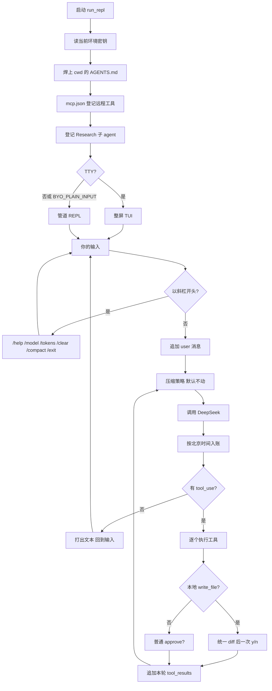

# build-rust-mini-coding-agent

用 Rust 按 [Build Your Own Coding Agent](https://www.byoharness.dev/index.html) 重建的学习用 harness。理念和分层对齐 [betta-tech/byo-coding-agent](https://github.com/betta-tech/byo-coding-agent)。对课在 [`follow_along/zh/`](follow_along/zh/00-introduction.md)。

模型写代码。Harness 决定它看见什么、记住什么、能碰什么。

**课是 Claude，跑的是 DeepSeek。** 原章用 Anthropic Messages 讲循环；本仓库的总体访问 `https://api.deepseek.com/chat/completions`（默认 `deepseek-flash`）。系统提示必须自称 DeepSeek。写代码用 Cursor，只有 `bash scripts/run.sh` 才打真实模型。

Agent 约定：[AGENTS.md](AGENTS.md)。读完一课再实现一课。总体入口是 [`src/main.rs`](src/main.rs)，它只调用 `repl::run_repl`。

## 会跑起来的 / 不会交付的

| 会跑起来的 | 不会交付的 |
|---|---|
| 已接到总体的第 01–12 课和第 14–18 课：循环、权限门、DeepSeek、斜杠、压缩、工具、子 agent、整屏、MCP、`AGENTS.md`、人民币用量、磁盘缓存、写文件 diff | 生产系统。目标是看清每根线 |
| 第 13 课只有对课，没有 example | 第 19 课 Agent memory 未写。流式输出未写 |

## 一次提交怎么走

启动只发生一次。下面从「你的输入」开始是每一轮。课号链到对课。



- 第 15 课：[AGENTS.md](follow_along/zh/15-agents-md.md) 在克隆 Research 之前焊上。缺文件就当没写。`/model` 只换行为半边。
- 第 14 课：[MCP](follow_along/zh/14-mcp-support.md) 挂进同一套工具表。没有 `mcp.json` 不打日志。退出时关掉子进程。
- 第 11 课：[Research](follow_along/zh/11-subagents.md) 只有 `read_file`，自己再跑一圈，不进这张图的审批。
- 第 12 课：终端是 TTY 走[整屏](follow_along/zh/12-full-tui.md)；管道或 `BYO_PLAIN_INPUT=1` 走 stdin。
- 第 05 / 16 课：斜杠不进模型。图上是常用的几个；另外还有 `/tools`、`/subagents`、`/verbose`。
- 第 07 课：默认 `NoCompaction`，不改 system。换成 sliding / summarize 后，下一轮从压缩后的 `messages` 再调用。
- 第 16 / 17 课：每次响应按北京时间把 token 计入人民币。[磁盘缓存](follow_along/zh/17-prompt-caching.md)默认开着，请求里不加 `cache_control`。
- 第 18 课：只有本地 [`write_file`](follow_along/zh/18-diff-approval.md) 先给统一 diff。其它工具，包括 MCP 写文件，仍是一次 `approve?`。拒绝不把 diff 交回模型。

内层循环单独画成 ASCII。形状对齐课程里的 agent loop，岔路是总体里已经接上的。

```text
[你的输入]
    │
    ▼
[以 / 开头?] ──yes──▶ [斜杠命令，不进模型]
    │
   no
    ▼
[追加到 messages]
    │
    ▼
[压缩] ──默认 NoCompaction，不改 system──┐
    │                                      │
    ▼                                      │
[调用 DeepSeek] ──用量入账─────────────────┤
    │                                      │
    ▼                                      │
[有 tool_use?] ──no──▶ [打出文本，回到输入]
    │
   yes
    ▼
[逐个工具]
    ├─ write_file ──▶ [diff] ──▶ [y/n]
    ├─ 其它工具 ──▶ [approve?]
    └─ delegate_research ──▶ [子循环，只有 read_file]
    │
    ▼
[追加 tool_results]  （id 必须对上）
    │
    └──▶ 回到「压缩」
```

Assistant 消息必须原样追加。漏了，下一轮孤立的 `tool_result` 会被接口拒绝。本轮全部工具结果放在同一条 user 消息里。

## 课表

### 00–04 · 最小循环

- [00 · 这是什么](follow_along/zh/00-introduction.md)
- [01 · Agent 循环](follow_along/zh/01-the-agent-loop.md)
- [02 · 权限门](follow_along/zh/02-the-permission-gate.md)
- [03 · Provider 接口](follow_along/zh/03-the-provider-interface.md)
- [04 · UI polish](follow_along/zh/04-ui-polish.md)

### 05–08 · 对话

- [05 · 斜杠命令](follow_along/zh/05-slash-commands.md)
- [06 · 对话状态](follow_along/zh/06-conversation-state.md)
- [07 · 压缩策略](follow_along/zh/07-compaction-strategies.md)
- [08 · 更好的输入](follow_along/zh/08-better-input.md)

### 09–12 · 工具与结构

- [09 · 可插拔工具](follow_along/zh/09-plug-and-play-tools.md)
- [10 · 项目结构](follow_along/zh/10-project-structure.md)
- [11 · 子 Agent](follow_along/zh/11-subagents.md)
- [12 · 整屏 TUI](follow_along/zh/12-full-tui.md)

### 13–18 · 再往前

- [13 · 接下来](follow_along/zh/13-whats-next.md)（只有对课，没有 `run.sh 13`）
- [14 · 接上 MCP](follow_along/zh/14-mcp-support.md)
- [15 · 项目上下文 AGENTS.md](follow_along/zh/15-agents-md.md)
- [16 · Token 与人民币](follow_along/zh/16-token-viewer.md)
- [17 · 提示词缓存](follow_along/zh/17-prompt-caching.md)
- [18 · 写文件前看 diff](follow_along/zh/18-diff-approval.md)
- 19 · Agent memory（未写）

## 怎么跑

兼容 Windows Git Bash / MSYS、PowerShell、macOS、Linux、WSL。各 OS / 各 WSL distro 的 `$HOME`、密钥、toolchain 完全隔离：WSL 不读 `/mnt/c`，Windows 不写 WSL `/home`。

Windows 上 MSYS 的 `$HOME` 经常是 `/home/<user>`，和 `C:\Users\<user>` 是同一台 Windows，不是 WSL。代理只是网络：本机 `127.0.0.1:7890`，WSL 走宿主机 `7890`。

```bash
bash scripts/bootstrap.sh         # 安装 rustup / rustfmt / clippy
bash scripts/build.sh
bash scripts/test.sh              # 总体（库 + bin），不读密钥
bash scripts/test-lessons.sh      # 单课 example；可跟 01 / list
bash scripts/check.sh             # 离线：fmt + clippy + test + 单课
bash scripts/test-flow.sh         # 离线 check + 键位手测清单
bash scripts/test-flow.sh --live  # 再加上管道实机：权限门 + .local/live-probe 读写
bash scripts/probe-llm.sh         # 打一次官方 completions，确认密钥（不打印 key）
bash scripts/run.sh               # 总体 src/main.rs
bash scripts/run.sh 01            # 第 01 课 demo
bash scripts/run.sh 02            # 第 02 课 demo
bash scripts/run.sh 03            # 第 03 课 demo
bash scripts/run.sh 04            # 第 04 课 demo
bash scripts/run.sh 05            # 第 05 课 demo
bash scripts/run.sh 06            # 第 06 课 demo
bash scripts/run.sh 07            # 第 07 课 demo
bash scripts/run.sh 08            # 第 08 课 demo
bash scripts/run.sh 09            # 第 09 课 demo
bash scripts/run.sh 10            # 第 10 课 demo
bash scripts/run.sh 11            # 第 11 课 demo
bash scripts/run.sh 12            # 第 12 课 demo
# 第 13 课只有对课文档，没有 run.sh 13
bash scripts/run.sh 14            # 第 14 课 demo（读 cwd 的 mcp.json；没有就当没装）
bash scripts/run.sh 15            # 第 15 课 demo（读 cwd 的 AGENTS.md；没有就当没写）
bash scripts/run.sh 16            # 第 16 课 demo（/tokens，人民币，分时段）
bash scripts/run.sh 17            # 第 17 课 demo（磁盘缓存；不发 cache_control）
bash scripts/run.sh 18            # 第 18 课 demo（write_file 先看 diff）
```

Windows PowerShell：`.\scripts\bootstrap.ps1`

`run.sh` 只认 **当前环境**：`DEEPSEEK_API_KEY` → `<home>/.dsh/.credentials.yaml` → `<home>/.dsh/.env` → `<home>/.pi/agent/auth.json`。Windows 还会看本机 `C:\Users\<user>`；WSL 只看自己的 `$HOME`。在这一侧用 [agent-config](../agent-config) apply，不要写进本仓库，也不要跨 OS 借密钥。字面量 `$DEEPSEEK_API_KEY` 不是真密钥。
