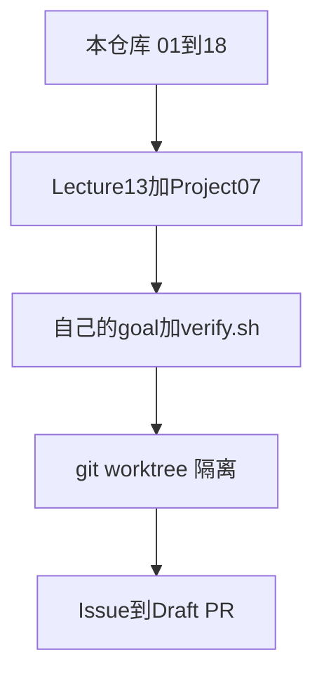

# 后学

这不是第 19 课，也不是 [byoharness](https://www.byoharness.dev/index.html) 某一章的对课。第 13 课停在这本书的缝，见 [13-whats-next.md](13-whats-next.md)。这里写的是书外的学习顺序。

本仓库是原计划**第一阶段的 Rust 实现**，而且已经超过原计划「只看懂 Agent Loop」的范围。后学从这里往外接，不从 §00 再学一遍。

## 原计划推荐的六套

每套都给出仓库地址。和本仓库重叠的只标「读哪一截」，不从第一课重做。

1. **Build Your Own Coding Agent**（第一阶段，本仓库已经在做）
   - 书：[byoharness.dev](https://www.byoharness.dev/index.html)
   - 仓库：[betta-tech/byo-coding-agent](https://github.com/betta-tech/byo-coding-agent)（Go 对照，约 130 行 minimal agent 在 `examples/minimal/`）
   - 本仓库：Rust 重建，已接到第 01–12 课和第 14–18 课。第 13 课只有对课。第 19 课未写：[Agent memory](https://www.byoharness.dev/chapters/19-agent-memory.html)
   - 后学：不重做 §00–§18。memory 仍属第一阶段收尾，点名再写

2. **Learn Harness Engineering**（后学阶段 A，主教材）
   - 仓库：[walkinglabs/learn-harness-engineering](https://github.com/walkinglabs/learn-harness-engineering)
   - 中文站：[walkinglabs.github.io/learn-harness-engineering](https://walkinglabs.github.io/learn-harness-engineering/)
   - 只做 Lecture 13：[从手动提示到自动循环](https://github.com/walkinglabs/learn-harness-engineering/blob/main/docs/en/lectures/lecture-13-loop-engineering/index.md)
   - 只做 Project 07：[Build Your First Automated Loop](https://github.com/walkinglabs/learn-harness-engineering/blob/main/docs/en/projects/project-07-loop-engineering-first-loop/index.md)，中文：[搭建你的第一个自动循环](https://walkinglabs.github.io/learn-harness-engineering/zh/projects/project-07-loop-engineering-first-loop/)
   - Lecture 14 只做第一张图：[`loops/graph.md`](../../loops/graph.md) + `/graph`。research 节点和并行未做
   - P01–P06 的练习不重做。Lecture 05 的跨会话交接本仓库没有：第 07 课只在同一会话里压缩。读过的结论在下面「已读笔记」
   - Lecture 13 的 `/goal` `/loop`、Lecture 14 的 `/graph` 已接到 REPL 斜杠；引擎在 `loops/`、`src/loop_ctl.rs`、`src/graph_ctl.rs`，不改 `agent_loop`

3. **Design Your Own Coding Agent Harness**（选读：沙箱、持久执行、评测、远程）
   - 视频：[Design Your Own Coding Agent Harness](https://www.youtube.com/watch?v=sJpop1juVBQ)（2026-08，Pydantic AI）
   - 配套仓库：[decodingai-magazine/building-a-coding-agent-from-scratch-course](https://github.com/decodingai-magazine/building-a-coding-agent-from-scratch-course)
   - 配套文：[Harness Architecture](https://www.decodingai.com/p/building-a-coding-agent-from-scratch-system-design)
   - read / write / edit / bash 本仓库已有。课程仓库第 3 课之后多处仍是 coming soon，不要卡住

4. **Learn Agent Harness**（原计划写的这一套，没有对上单一仓库）
   - 原描述：拿 Pi、Codex、learn-claude-code、Hermes 分析，再用 Rust 写一个简化 Pi
   - 被分析的四个真实项目：
     - Pi：[earendil-works/pi](https://github.com/earendil-works/pi)
     - Codex CLI：[openai/codex](https://github.com/openai/codex)
     - learn-claude-code：[shareAI-lab/learn-claude-code](https://github.com/shareAI-lab/learn-claude-code)
     - Hermes：[NousResearch/hermes-agent](https://github.com/NousResearch/hermes-agent)，文档 [hermes-agent.nousresearch.com/docs](https://hermes-agent.nousresearch.com/docs/)
   - 最接近的 Rust 材料（选读，不把 01–18 再写一遍）：
     - [wulawulu/learn-claude-code-rs](https://github.com/wulawulu/learn-claude-code-rs)（从记忆 / 多 agent / worktree 往后翻，跳过 `s01`）
     - [Hamiltonxx/learn-claude-code-rust](https://github.com/Hamiltonxx/learn-claude-code-rust)（s12 worktree）
     - [bigfish1913/pi-rust](https://github.com/bigfish1913/pi-rust)（`rpi-agent` → `rpi-harness`，读分层，不移植进本仓库）

5. **Build Harness**（选读：意图 / 执行 / 策略 / 验收怎么分开）
   - 仓库：[LienJack/build-harness](https://github.com/LienJack/build-harness)
   - 只读控制面：[00-04 harness control system](https://github.com/LienJack/build-harness/blob/main/docs/en/00-04-harness-control-system.md)
   - 从 CLI 助手长到 loop / tools 的前半和本仓库重叠，不重做

6. **GitHub Agentic Workflows**（后学阶段 D）
   - 仓库：[github/gh-aw](https://github.com/github/gh-aw)
   - 文档：[github.github.com/gh-aw](https://github.github.com/gh-aw/)
   - 编译进 Actions 的动作仓库：[github/gh-aw-actions](https://github.com/github/gh-aw-actions)
   - 引擎用清单 4 里的 Pi 或 Codex，不新造一套 agent

明确先不做的框架（原计划第 7 条）：

- [langchain-ai/langchain](https://github.com/langchain-ai/langchain)
- [langchain-ai/langgraph](https://github.com/langchain-ai/langgraph)
- [microsoft/autogen](https://github.com/microsoft/autogen)
- [crewAIInc/crewAI](https://github.com/crewAIInc/crewAI)

## 本仓库已经回答的

对照原计划最后的 8 问，前 4 问在这个仓库里已经有线：

- Model：DeepSeek Chat Completions，[`src/`](../../src/lib.rs) 的 `Provider`
- Agent Loop：用户 → 模型 → 工具 → 结果 → 再调用
- Tool：Registry、权限门、本地 `write_file` 的 diff
- Context：压缩、`AGENTS.md`、磁盘缓存、人民币用量、MCP、一个只读子 agent

课表走到第 18 课。对应上面清单第 1 套。第 19 课、流式、`PermissionPolicy`、会话存盘仍属第一阶段收尾，点名再做。

## 后学要补的四问

- State 放哪：对话仍在内存里的 `messages`。任务状态在 `.local/loop/loop-state.md`。图的 checkpoint 在 `.local/graph/<thread>/state.md`。第五讲和 dsh / Pi / Cursor 的读法见「已读笔记」
- Verify 怎么做：`scripts/check.sh` 测的是这个 harness。`/goal` 和 `/graph` 的 checker 是 `goal.md` 里的验证命令退出码，不叫模型
- Failure 怎么恢复：工具错误会回到模型。`/goal` 失败时读 `loop-state.md` 再开一轮 maker。`/graph` 的 verify fail 按路由表回到 implement
- 什么时候停：普通对话仍是模型不再要工具，或人退出。`/goal` 停在验证通过、最大回合、或 `/goal stop`。`/loop` 停在 `/loop stop`。`/graph` 停在 pause（等人 `/graph approve`）、blocked、done、或 `/graph stop`



## 已读笔记 · 跨会话交接

读过，不实现。不改 `src/`，不把 [第五讲](https://walkinglabs.github.io/learn-harness-engineering/zh/lectures/lecture-05-why-long-running-tasks-lose-continuity/) 或 Project 03 做成练习。

### 第五讲：快满时交给下一会话的是文件

上下文大约超过窗口的 60% 就准备交接。大约 30 分钟内能做完的留在当前会话。不把 `messages` 贴进下一会话。

最小进度文件四个字段：仓库状态（commit）、运行时状态（测试通过率）、阻塞项、下一步。会再次被推翻的选择另记：决定、原因、否决方案、约束。git 提交是检查点。上班先读这些文件再跑检查，从「下一步」继续；下班先更新文件、跑检查、再提交。

第 07 课的压缩留在同一会话，留下「做了什么」，决策理由容易没了。第五讲要的重置是清空短期记忆，用文件重建。有的模型接近窗口上限会赶工、跳过验证，所以交接发生在顶满之前。主要靠压缩还是靠重置，要看具体模型。

### dsh、Pi、Cursor：快满时仍留在同一条会话

| | 快满时 | 空白的下一条会话 |
|---|---|---|
| DSH | 默认 [`dsh-compaction-basic`](https://github.com/deepseek-ai/deepseek-harness/blob/master/packages/compaction/compaction-basic/README.md)。门槛 `floor(min(W×0.8, W−O−65536))`，最近约 `(W−O)×0.16` 原文留下。旧表面换成一条带 `<compacted-summary>` 的 user 消息。摘要固定八节：意图、技术概念、文件、错误与修复、未完成、当前工作、下一步、关键上下文。 | 官方 `fork` 克隆已结束回合的事件前缀。干净摘要进新会话靠社区插件，例如 [dsh-session-handoff](https://github.com/WeiYe6/dsh-session-handoff) 的 `/handoff`。 |
| Pi | [压缩](https://pi.dev/docs/latest/compaction) 写进 `~/.pi/agent/sessions/` 的 JSONL。`contextTokens > contextWindow − 16384` 时摘要旧段，最近约 20000 token 留下。摘要含目标、约束、进度、决策、下一步、关键上下文和文件清单。`/resume` 仍是这份文件。 | 示例 [`handoff.ts`](https://github.com/earendil-works/pi/blob/main/packages/coding-agent/examples/extensions/handoff.ts) 由人执行 `/handoff`，生成可编辑提示再 `newSession`。自动按分支注入的是第三方 [pi-handoff](https://github.com/FleetingEcho/pi-handoff)。 |
| Cursor | [同一条聊天里压缩](https://cursor.com/docs/agent/prompting)。文档写「接近满」；论坛工作人员说过大约 90%，门槛在服务端。`/summarize` 可提前做。 | 新聊天不带上一条的任务状态。[Rules](https://cursor.com/docs/rules) 和 `AGENTS.md` 每次都在，那是约定，不是进度。`@Chats` 显式引用旧对话。`--resume` 继续同一条线程。 |

### 一条会话再叫子 agent，和再开一条会话不是同一条路

| | 模型能叫的子 agent | 人另开的会话 |
|---|---|---|
| DSH | [`dsh-tool-subagent`](https://github.com/deepseek-ai/deepseek-harness/blob/master/packages/subagent/tool-subagent/README.md)。`spawn` 是空白子会话；`fork` 带上父会话已结束的回合。one-shot 做完把结果交回。continuable 持久化，父会话用 `send_message` 再发；子会话不在内存里就从自己的日志冷启动。 | `/handoff` 插件，以及 `ctx.sessions.fork` |
| Pi | 内核没有这个工具。内置工具是 `read`、`bash`、`edit`、`write`，外加可选的 `grep`、`find`、`ls`。扩展才注册，例如 [pi-subagents](https://pi.dev/packages/pi-subagents) 的 `subagent`。子会话默认空白；有的扩展可用 `session: fork` 从父会话当前叶子分出。 | `/new`、`/fork`、`/clone`、示例 `/handoff` |
| Cursor | [Task 工具](https://cursor.com/docs/subagents)。内置 `explore`、`bash`、`browser`。子 agent 自己的窗口，看不到父会话历史，父会话把需要的内容写进提示。主会话和直接子 agent 还能再拉一层，再下一层不能。可用 agent id 恢复。 | `/fork`、`/side`、`/in-cloud`。子 agent 的 worktree 仍算在同一条用户会话里。 |

三家都不会在上下文快满时自动改开一条空白会话。进度要进下一条空白会话，靠人触发或插件把短文档注入。本仓库第 11 课的 Research 是一次性只读子循环，没有 continuable。`/goal` 的进度写在 `.local/loop/loop-state.md`，不进 `agent_loop`。

## 已读笔记 · 图工程

读过 [第十四讲](https://walkinglabs.github.io/learn-harness-engineering/zh/lectures/lecture-14-graph-engineering/)。prompt / context / loop / graph 是叠加，不是替换。图的四零件：节点、边、共享状态、路由。单循环把「失败回哪」藏在同一段上下文里；图写在纸上。

六步：状态 → 节点 → 边 → 路由 → checkpoint → 跑。本仓库第一张图是 maker-checker：`implement` → `verify` → pass 则 `pause`（merge 前等人 `/graph approve`），fail 则回到 `implement`。verify 只看验证命令退出码，不继承 implement 的对话。`merge` 只写完成状态，不自动 `git commit`。

未做：research 节点、并行 fan-out、LangGraph / LangChain。编排税仍在：节点可以并行，审阅带宽是串行的。五个判据至少三条才值得再加节点。

蓝图在 [`loops/graph.md`](../../loops/graph.md)。checkpoint 在 `.local/graph/<thread>/state.md`。

## 阶段 A · 自动循环（清单第 2 套）

主教材是 [walkinglabs/learn-harness-engineering](https://github.com/walkinglabs/learn-harness-engineering) 的 [第十三讲](https://walkinglabs.github.io/learn-harness-engineering/zh/lectures/lecture-13-loop-engineering/) 和 [Project 07](https://walkinglabs.github.io/learn-harness-engineering/zh/projects/project-07-loop-engineering-first-loop/)。P01–P06 不重做。`agent_loop` 没改。

有终点用 `/goal`，没终点、只要反复看一眼用 `/loop`。`/loop` 不读、不写 `loop-state.md`。

| 斜杠 | 作用 |
|---|---|
| `/goal <目标>` | 用 [`loops/goal.md`](../../loops/goal.md) 武装，运行副本在 `.local/loop/` |
| `/goal` | 看目标、验证命令、轮次 |
| `/goal run` | 后台跑 [`scripts/goal-run.sh`](../../scripts/goal-run.sh) |
| `/goal stop` | 写停止标记 |
| `/loop <间隔> <巡检>` | 例如 `/loop 15m 跑测试，失败只报告` |
| `/loop run` / `/loop stop` | 启动或停 [`scripts/loop-tick.sh`](../../scripts/loop-tick.sh) |
| `/graph <目标>` | 武装默认 thread `session-1`，共用 `goal.md` 的验证命令 |
| `/graph` | 看当前节点、review、attempts |
| `/graph run [thread]` | 后台 [`scripts/graph-run.sh`](../../scripts/graph-run.sh)，走到 pause 停 |
| `/graph approve` | 只在 pause 时放行 merge |
| `/graph stop` | 写停止标记 |

模板在 [`loops/`](../../loops/goal.md)。验证命令仍是 `REPLACE_ME` 时 `/goal run` 和 `/graph run` 拒绝。Checker 只看该命令退出码。Maker 是一次 `BYO_ONCE=1` 的现有 harness。

对照：[shareAI-lab/learn-claude-code](https://github.com/shareAI-lab/learn-claude-code) 的 `s17_goal_loop`（读 `s17`，不要从 `s01` 重写）。

## 阶段 B · 自己写 /goal（原第三阶段）

不再看新教程。用已经在用的 Pi 或 Codex，写 200～500 行（Shell 或 Python 即可）：

```text
goal → state.md → Pi 或 Codex 改代码 → ./verify.sh
失败 → 再叫一轮
通过 → 停
```

引擎用清单第 4 套里的两个 CLI（调用，不移植进本仓库）：

- Pi：[earendil-works/pi](https://github.com/earendil-works/pi)
- Codex CLI：[openai/codex](https://github.com/openai/codex)

验收标准：同一条 goal 在你离开键盘后能自己停，并且失败时读的是 `state.md` 而不是把整段聊天再贴一遍。

## 阶段 C · worktree（原第四阶段）

一个目录里同时跑多个 agent 会互相改文件。这一阶段只加隔离：

- Agent A → worktree A → branch A
- Agent B → worktree B → branch B

代码对照用清单第 4 套，只翻 worktree 那一章：

- [Hamiltonxx/learn-claude-code-rust](https://github.com/Hamiltonxx/learn-claude-code-rust) 的 s12
- 同一机制的 Python 原文：[shareAI-lab/learn-claude-code](https://github.com/shareAI-lab/learn-claude-code)

命令面：`git worktree`、`git branch`、`git commit`、`git diff`、`git reset`、`gh issue`、`gh pr`。

## 阶段 D · Issue 到 Draft PR（清单第 6 套）

- 仓库：[github/gh-aw](https://github.com/github/gh-aw)
- 文档：[github.github.com/gh-aw](https://github.github.com/gh-aw/)
- 动作仓库：[github/gh-aw-actions](https://github.com/github/gh-aw-actions)

先写一条 `.github/workflows/*.md`，`gh aw compile` 出 `.lock.yml`。引擎用已支持的 Pi（也支持 Codex）。路径：

```text
Issue → worktree/branch → Agent → verify.sh → 失败再修 → commit → push → Draft PR
```

第二条再做：CI 失败 → 读日志 → 修 → 再推。不要和第一条挤在同一次。

## 选读怎么用上面的清单

清单第 3、4、5 套不进主线。缺口对上再翻：

- 第 3 套：持久执行、沙箱、评测、远程并行。read / write / edit / bash 不再做
- 第 4 套：worktree / teams / cron 看 learn-claude-code 的 Rust 端口；Pi 分层看 [bigfish1913/pi-rust](https://github.com/bigfish1913/pi-rust)；技能从经验里长出来只读 Hermes 架构
- 第 5 套：意图和执行分开、策略和沙箱分开、用证据判断做完。前半 CLI 循环不重做
- 清单第 2 套的 Lecture 14 第一张图已接到 `/graph`。Project 08 的其余练习（research 节点、并行）未做

也不做：把本仓库改成 Pi 移植、用另一门 Rust 课把 01–18 再写一遍、在未点名时补第 19 课。

## 完成判据

后学做完时，拿本仓库回答 1–4，拿阶段 A–D 的产物回答 5–8：状态在文件里，验收是独立命令，失败从状态再开一轮，停止条件写在 goal 里而不是「模型不想调用工具了」。
