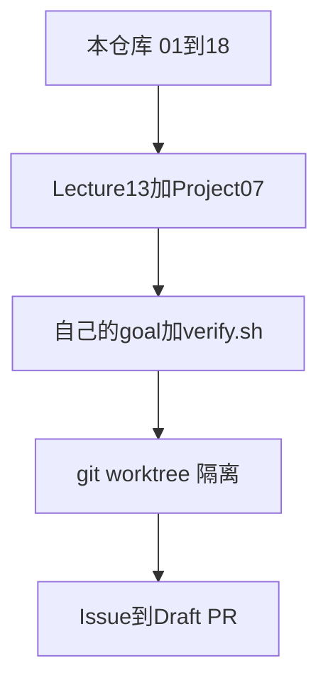

# 后学

这不是第 19 课，也不是 [byoharness](https://www.byoharness.dev/index.html) 某一章的对课。第 13 课停在这本书的缝，见 [13-whats-next.md](13-whats-next.md)。这里写的是书外的学习顺序。

本仓库是原计划**第一阶段的 Rust 实现**，而且已经超过原计划「只看懂 Agent Loop」的范围。后学从这里往外接，不从 §00 再学一遍。

## 原计划推荐的六套

每套都给出仓库地址。和本仓库重叠的只标「读哪一截」，不从第一课重做。

1. **Build Your Own Coding Agent**（第一阶段，本仓库已经在做）
   - 书：[byoharness.dev](https://www.byoharness.dev/index.html)
   - 仓库：[betta-tech/byo-coding-agent](https://github.com/betta-tech/byo-coding-agent)（Go 对照，约 130 行 minimal agent 在 `examples/minimal/`）
   - 本仓库：Rust 重建，已接到第 01–12 课和第 14–18 课。第 13 课只有对课。第 19 课未写：[Agent memory](https://www.byoharness.dev/chapters/19-agent-memory.html)
   - 后学：不重做 §00–§18。memory 仍属第一阶段收尾，点名再写

2. **Learn Harness Engineering**（后学阶段 A，主教材）
   - 仓库：[walkinglabs/learn-harness-engineering](https://github.com/walkinglabs/learn-harness-engineering)
   - 中文站：[walkinglabs.github.io/learn-harness-engineering](https://walkinglabs.github.io/learn-harness-engineering/)
   - 只做 Lecture 13：[从手动提示到自动循环](https://github.com/walkinglabs/learn-harness-engineering/blob/main/docs/en/lectures/lecture-13-loop-engineering/index.md)
   - 只做 Project 07：[Build Your First Automated Loop](https://github.com/walkinglabs/learn-harness-engineering/blob/main/docs/en/projects/project-07-loop-engineering-first-loop/index.md)，中文：[搭建你的第一个自动循环](https://walkinglabs.github.io/learn-harness-engineering/zh/projects/project-07-loop-engineering-first-loop/)
   - P01–P06 是 harness 本体，本仓库已覆盖，跳过

3. **Design Your Own Coding Agent Harness**（选读：沙箱、持久执行、评测、远程）
   - 视频：[Design Your Own Coding Agent Harness](https://www.youtube.com/watch?v=sJpop1juVBQ)（2026-08，Pydantic AI）
   - 配套仓库：[decodingai-magazine/building-a-coding-agent-from-scratch-course](https://github.com/decodingai-magazine/building-a-coding-agent-from-scratch-course)
   - 配套文：[Harness Architecture](https://www.decodingai.com/p/building-a-coding-agent-from-scratch-system-design)
   - read / write / edit / bash 本仓库已有。课程仓库第 3 课之后多处仍是 coming soon，不要卡住

4. **Learn Agent Harness**（原计划写的这一套，没有对上单一仓库）
   - 原描述：拿 Pi、Codex、learn-claude-code、Hermes 分析，再用 Rust 写一个简化 Pi
   - 被分析的四个真实项目：
     - Pi：[earendil-works/pi](https://github.com/earendil-works/pi)
     - Codex CLI：[openai/codex](https://github.com/openai/codex)
     - learn-claude-code：[shareAI-lab/learn-claude-code](https://github.com/shareAI-lab/learn-claude-code)
     - Hermes：[NousResearch/hermes-agent](https://github.com/NousResearch/hermes-agent)，文档 [hermes-agent.nousresearch.com/docs](https://hermes-agent.nousresearch.com/docs/)
   - 最接近的 Rust 材料（选读，不把 01–18 再写一遍）：
     - [wulawulu/learn-claude-code-rs](https://github.com/wulawulu/learn-claude-code-rs)（从记忆 / 多 agent / worktree 往后翻，跳过 `s01`）
     - [Hamiltonxx/learn-claude-code-rust](https://github.com/Hamiltonxx/learn-claude-code-rust)（s12 worktree）
     - [bigfish1913/pi-rust](https://github.com/bigfish1913/pi-rust)（`rpi-agent` → `rpi-harness`，读分层，不移植进本仓库）

5. **Build Harness**（选读：意图 / 执行 / 策略 / 验收怎么分开）
   - 仓库：[LienJack/build-harness](https://github.com/LienJack/build-harness)
   - 只读控制面：[00-04 harness control system](https://github.com/LienJack/build-harness/blob/main/docs/en/00-04-harness-control-system.md)
   - 从 CLI 助手长到 loop / tools 的前半和本仓库重叠，不重做

6. **GitHub Agentic Workflows**（后学阶段 D）
   - 仓库：[github/gh-aw](https://github.com/github/gh-aw)
   - 文档：[github.github.com/gh-aw](https://github.github.com/gh-aw/)
   - 编译进 Actions 的动作仓库：[github/gh-aw-actions](https://github.com/github/gh-aw-actions)
   - 引擎用清单 4 里的 Pi 或 Codex，不新造一套 agent

明确先不做的框架（原计划第 7 条）：

- [langchain-ai/langchain](https://github.com/langchain-ai/langchain)
- [langchain-ai/langgraph](https://github.com/langchain-ai/langgraph)
- [microsoft/autogen](https://github.com/microsoft/autogen)
- [crewAIInc/crewAI](https://github.com/crewAIInc/crewAI)

## 本仓库已经回答的

对照原计划最后的 8 问，前 4 问在这个仓库里已经有线：

- Model：DeepSeek Chat Completions，[`src/`](../../src/lib.rs) 的 `Provider`
- Agent Loop：用户 → 模型 → 工具 → 结果 → 再调用
- Tool：Registry、权限门、本地 `write_file` 的 diff
- Context：压缩、`AGENTS.md`、磁盘缓存、人民币用量、MCP、一个只读子 agent

课表走到第 18 课。对应上面清单第 1 套。第 19 课、流式、`PermissionPolicy`、会话存盘仍属第一阶段收尾，点名再做。

## 后学要补的四问

- State 放哪：现在只有内存里的 `messages`，输入历史不是任务状态
- Verify 怎么做：`scripts/check.sh` 测的是这个 harness，不是「agent 改完代码后自己验收」
- Failure 怎么恢复：工具错误会回到模型；没有「目标没完成就从状态文件再开一轮」
- 什么时候停：模型不再要工具，或人退出。没有「目标达成 / 轮数上限」



## 阶段 A · 自动循环（清单第 2 套，跳过已会的）

主教材是 [walkinglabs/learn-harness-engineering](https://github.com/walkinglabs/learn-harness-engineering)。不要把 P01–P06 再做一遍。只做：

- Lecture 13：[从手动提示到自动循环](https://github.com/walkinglabs/learn-harness-engineering/blob/main/docs/en/lectures/lecture-13-loop-engineering/index.md)
- Project 07：[Build Your First Automated Loop](https://github.com/walkinglabs/learn-harness-engineering/blob/main/docs/en/projects/project-07-loop-engineering-first-loop/index.md)，中文：[搭建你的第一个自动循环](https://walkinglabs.github.io/learn-harness-engineering/zh/projects/project-07-loop-engineering-first-loop/)

按这个顺序做三个实验，都在**另一个小目录**里，不改本仓库的 agent 循环：

- Goal loop：`goal.md`，人还在旁边看
- Timer loop：同一件事定时再跑
- Maker-checker：写的人和验的人分开；状态在 `loop-state.md`；停在「验收通过」或轮数上限

模板就在该仓库：`goal-template.md`、`loop-state-template.md`、`maker-prompt.md`、`checker-prompt.md`。

对照可运行的 goal 终点（清单第 4 套里的 learn-claude-code，读 `s17`，不要从 `s01` 重写）：

- [shareAI-lab/learn-claude-code](https://github.com/shareAI-lab/learn-claude-code) 的 `s17_goal_loop`

## 阶段 B · 自己写 /goal（原第三阶段）

不再看新教程。用已经在用的 Pi 或 Codex，写 200～500 行（Shell 或 Python 即可）：

```text
goal → state.md → Pi 或 Codex 改代码 → ./verify.sh
失败 → 再叫一轮
通过 → 停
```

引擎用清单第 4 套里的两个 CLI（调用，不移植进本仓库）：

- Pi：[earendil-works/pi](https://github.com/earendil-works/pi)
- Codex CLI：[openai/codex](https://github.com/openai/codex)

验收标准：同一条 goal 在你离开键盘后能自己停，并且失败时读的是 `state.md` 而不是把整段聊天再贴一遍。

## 阶段 C · worktree（原第四阶段）

一个目录里同时跑多个 agent 会互相改文件。这一阶段只加隔离：

- Agent A → worktree A → branch A
- Agent B → worktree B → branch B

代码对照用清单第 4 套，只翻 worktree 那一章：

- [Hamiltonxx/learn-claude-code-rust](https://github.com/Hamiltonxx/learn-claude-code-rust) 的 s12
- 同一机制的 Python 原文：[shareAI-lab/learn-claude-code](https://github.com/shareAI-lab/learn-claude-code)

命令面：`git worktree`、`git branch`、`git commit`、`git diff`、`git reset`、`gh issue`、`gh pr`。

## 阶段 D · Issue 到 Draft PR（清单第 6 套）

- 仓库：[github/gh-aw](https://github.com/github/gh-aw)
- 文档：[github.github.com/gh-aw](https://github.github.com/gh-aw/)
- 动作仓库：[github/gh-aw-actions](https://github.com/github/gh-aw-actions)

先写一条 `.github/workflows/*.md`，`gh aw compile` 出 `.lock.yml`。引擎用已支持的 Pi（也支持 Codex）。路径：

```text
Issue → worktree/branch → Agent → verify.sh → 失败再修 → commit → push → Draft PR
```

第二条再做：CI 失败 → 读日志 → 修 → 再推。不要和第一条挤在同一次。

## 选读怎么用上面的清单

清单第 3、4、5 套不进主线。缺口对上再翻：

- 第 3 套：持久执行、沙箱、评测、远程并行。read / write / edit / bash 不再做
- 第 4 套：worktree / teams / cron 看 learn-claude-code 的 Rust 端口；Pi 分层看 [bigfish1913/pi-rust](https://github.com/bigfish1913/pi-rust)；技能从经验里长出来只读 Hermes 架构
- 第 5 套：意图和执行分开、策略和沙箱分开、用证据判断做完。前半 CLI 循环不重做
- 清单第 2 套做完 Project 07 之后，可选 Lecture 14 / Project 08：[lecture-14-graph-engineering](https://github.com/walkinglabs/learn-harness-engineering/blob/main/docs/en/lectures/lecture-14-graph-engineering/index.md)

也不做：把本仓库改成 Pi 移植、用另一门 Rust 课把 01–18 再写一遍、在未点名时补第 19 课。

## 完成判据

后学做完时，拿本仓库回答 1–4，拿阶段 A–D 的产物回答 5–8：状态在文件里，验收是独立命令，失败从状态再开一轮，停止条件写在 goal 里而不是「模型不想调用工具了」。
